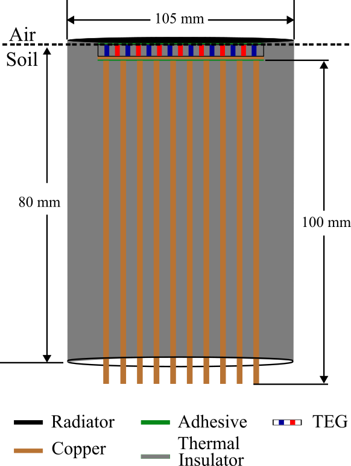
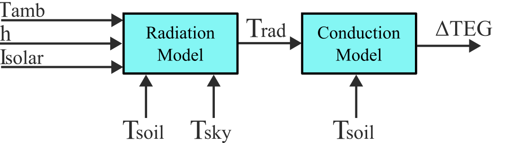
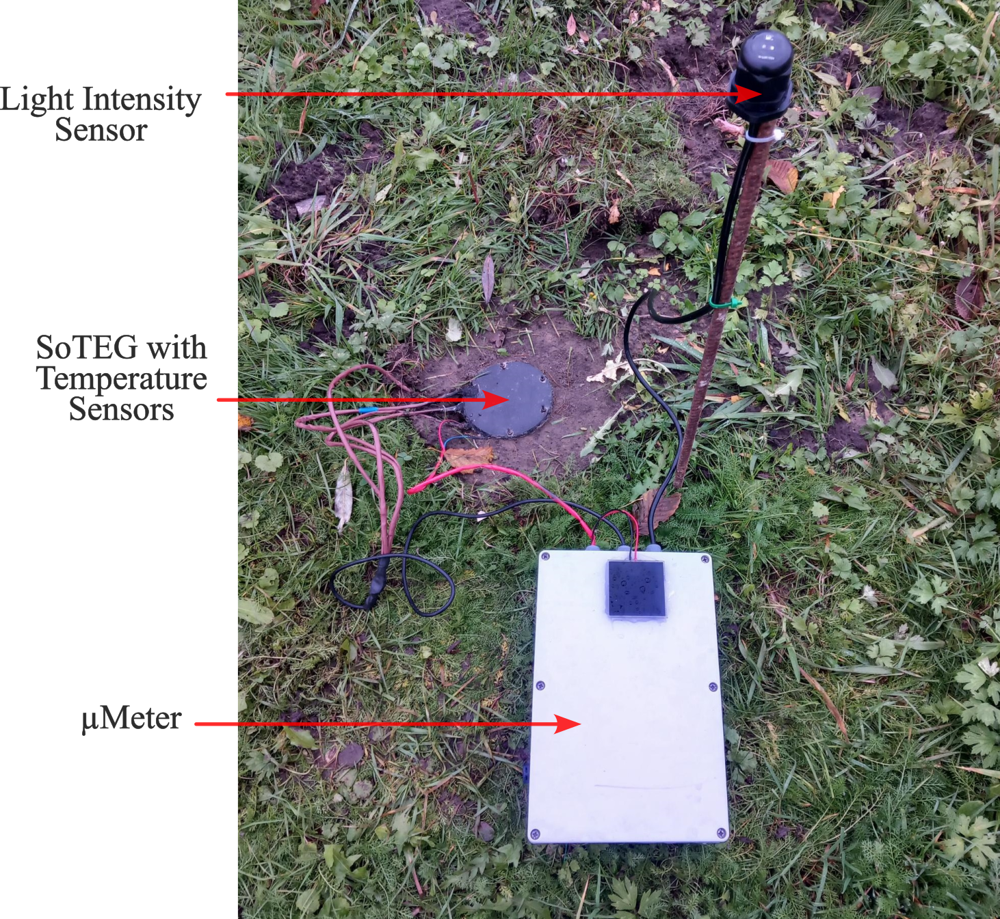

# Soil-Air Thermal Energy Generator
<figure>
  
  <figcaption>Figure 1: A sketch showing the structure of the energy generator.</figcaption>
</figure><br> <br>

<p align="justify"> This Python script models a Soil-Air Thermal Energy Generator (SoTEG), which harnesses energy from the temperature difference between the soil and air using a thermoelectric generator (TEG). The SoTEG consists of a copper heat radiator (absorber) and a copper heat conductor, with the TEG placed between them as shown in Fig. 1. The model simulates one-dimensional heat transfer within the SoTEG due to conduction, radiation, and natural convection. By inputting ambient parameters (soil temperature, air temperature, wind speed, irradiance, and sky temperature), the model estimates the power generated by the SoTEG. </p> <br> <br>

<figure>
  
  <figcaption>Figure 2: A diagrammatic representation of the SoTEG model.</figcaption>
</figure><br> <br>

The temperature difference across the TEG, <br>

$$
\begin{equation}{\Delta T = (T_{rad} - T_{soil})\frac {R_{TEG}}{R_{SoTEG}}} \end{equation}
$$ <br>

where  $R_{TEG}$ is the thermal resistance of the TEG and $R_{SoTEG}$ is the total thermal resistance of the SoTEG, given as, <br>

$${R_{SoTEG} = R_{RAD} + 2 R_{ADH} + R_{TEG} + R_{CPLT} + \frac {R_{CROD}}{5}}$$ <br>

The radiator temperature $T_{rad}$ can be calculated as, <br>

$${T_{rad}^{4} + m T_{rad} {-} c = 0}$$ <br>

where, <br>

$$m  = \frac {1}{\sigma \varepsilon } \left ({{ h + \frac {1}{A R_{SoTEG}}}}\right)$$ <br> 

$$c = T_{sky}^{4} + \frac {1}{\sigma \varepsilon } \left ({{ (h T_{air}) + Q_{solar} + \frac {T_{soil}}{A R_{SoTEG}}}}\right)$$ <br>

The temperature of the sky can be approximated as, <br>

```math
\begin{equation}{T_{sky} = \varepsilon _{sky}^{\frac {1}{4}} T_{amb}} \end{equation}
```

<p align="justify">where $\varepsilon _{sky}$ is the  emissivity of the sky which depends on dew temperature $T_{d}$ and sky opacity N. For approximate calculations, the temperature of the sky can be assumed to be 0°C.</p> <br>

Finally, the power generated by the TEG can be estimated using the equation, <br>

```math
P_{TEG} = \frac {V_{OC}^{2}}{4 R_{L}}
```

where $V_{OC}$ is the open circuit voltage of the TEG and $R_{L}$ is the load resistance on the TEG.

# Live Data

<figure>
  
  <figcaption>Figure 3: A photo of the SoTEG installation at the CDE campus.</figcaption>
</figure><br> <br>

The prototype of the SoTEG is currently deployed at the N-Site at the Campus Drie Eiken of the University of Antwerp. We will soon publish live data from the prototype. 
# Publications
You may cite this script as:

@ARTICLE{soteg,<br /> 
    &nbsp;&nbsp; author={Puluckul, Priyesh Pappinisseri and Weyn, Maarten},<br /> 
    &nbsp;&nbsp; journal={IEEE Access}, <br />
    &nbsp;&nbsp; title={Harvesting Energy From Soil-Air Temperature Differences for Batteryless IoT Devices: A Case Study},<br />
    &nbsp;&nbsp; year={2024},<br /> 
    &nbsp;&nbsp; volume={12},<br /> 
    &nbsp;&nbsp; pages={85306-85323},<br /> 
    &nbsp;&nbsp; doi={10.1109/ACCESS.2024.3414652}<br />
}
